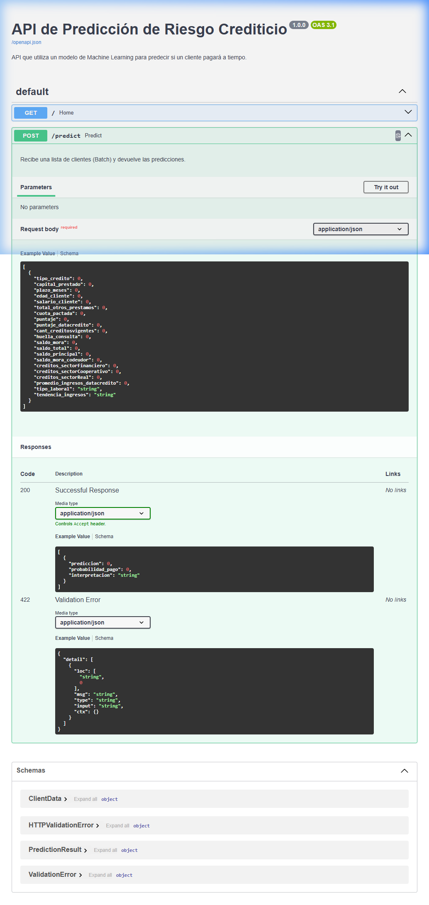

# 📘 MLOps Pipeline: Sistema Integral de Predicción de Riesgo Crediticio

**Proyecto Integrador M5 - Dody Salim Dueñas Remache**

---

## 📋 Tabla de Contenidos

1.  [Resumen Ejecutivo](#1-resumen-ejecutivo)
2.  [Contexto y Problema de Negocio](#2-contexto-y-problema-de-negocio)
3.  [Arquitectura de Datos](#3-arquitectura-de-datos)
    *   [3.1 Diccionario de Datos](#31-diccionario-de-datos)
    *   [3.2 Flujo del Pipeline](#32-flujo-del-pipeline)
    *   [3.3 Estructura del Proyecto](#33-estructura-del-proyecto)
4.  [Metodología: Avance 1 (Análisis Exploratorio de Datos)](#4-metodología-avance-1-análisis-exploratorio-de-datos)
    *   [4.1 Análisis Univariado](#41-análisis-univariado)
    *   [4.2 Análisis Bivariado](#42-análisis-bivariado)
    *   [4.3 Calidad de Datos](#43-calidad-de-datos)
5.  [Metodología: Avance 2 (Ingeniería de Características y Modelado)](#5-metodología-avance-2-ingeniería-de-características-y-modelado)
    *   [5.1 Pipeline de Preprocesamiento](#51-pipeline-de-preprocesamiento)
    *   [5.2 Selección de Modelos](#52-selección-de-modelos)
    *   [5.3 Evaluación de Desempeño](#53-evaluación-de-desempeño)
6.  [Metodología: Avance 3 (Monitoreo y MLOps)](#6-metodología-avance-3-monitoreo-y-mlops)
    *   [6.1 Teoría de Detección de Drift](#61-teoría-de-detección-de-drift)
    *   [6.2 Dashboard de Monitoreo (Streamlit)](#62-dashboard-de-monitoreo-streamlit)
    *   [6.3 Interpretación de Gráficos Avanzados](#63-interpretación-de-gráficos-avanzados)
7.  [Manual de Instalación y Uso](#7-manual-de-instalación-y-uso)
8.  [Conclusiones y Trabajo Futuro](#8-conclusiones-y-trabajo-futuro)
9.  [Autores y Créditos](#9-autores-y-créditos)

---

## 1. Resumen Ejecutivo

Este proyecto presenta una solución **End-to-End de MLOps** diseñada para abordar el desafío de la predicción de riesgo crediticio en una institución financiera. La solución no solo incluye el desarrollo de modelos predictivos de alto rendimiento, sino que integra un pipeline robusto de ingeniería de datos y un sistema de monitoreo continuo en producción.

El sistema es capaz de:
1.  Ingestar y procesar datos crudos de clientes financieros.
2.  Predecir con alta precisión la probabilidad de que un cliente pague a tiempo (`Pago_atiempo`).
3.  Monitorear en tiempo real la salud del modelo, detectando **Data Drift** (degradación de datos) y **Concept Drift** (cambios en patrones de comportamiento).
4.  Visualizar métricas clave a través de un dashboard interactivo profesional.

---

## 2. Contexto y Problema de Negocio

### El Desafío
En el sector financiero, la capacidad de distinguir entre un "buen pagador" y un "mal pagador" es crítica.
*   **Falsos Negativos (Riesgo)**: Clasificar a un mal pagador como bueno resulta en pérdida directa de capital (Default).
*   **Falsos Positivos (Costo de Oportunidad)**: Clasificar a un buen pagador como malo resulta en pérdida de ingresos por intereses y clientes insatisfechos.

### La Solución Propuesta
Desarrollar un modelo de clasificación binaria (`1`: Paga a tiempo, `0`: No paga a tiempo) que optimice el equilibrio entre precisión y exhaustividad (Recall), priorizando la identificación correcta de los casos de riesgo.

Además, dado que el entorno económico es cambiante, el modelo no puede ser estático. Se requiere un sistema de **Monitoreo Continuo (Drift Detection)** para alertar cuando los datos de entrada (distribución de salarios, edades, montos de préstamos) cambien significativamente respecto a los datos con los que el modelo fue entrenado.

---

## 3. Arquitectura de Datos

### 3.1 Diccionario de Datos

El dataset utilizado contiene información demográfica, financiera y comportamental de los clientes.

| Variable | Tipo | Descripción | Tratamiento en Pipeline |
| :--- | :--- | :--- | :--- |
| `id_cliente` | Texto | Identificador único del cliente. | **Excluido** del modelado y monitoreo. |
| `fecha_prestamo` | Fecha/Texto | Fecha de otorgamiento del crédito. | **Excluido** del monitoreo de drift para evitar ruido. |
| `edad` | Numérico | Edad del cliente en años. | Imputación (Mediana) + Escalado Estándar. |
| `ingresos_anuales` | Numérico | Ingresos totales anuales del cliente. | Imputación (Mediana) + Escalado Estándar. |
| `monto_prestamo` | Numérico | Monto total solicitado. | Imputación (Mediana) + Escalado Estándar. |
| `tasa_interes` | Numérico | Tasa de interés aplicada al préstamo. | Imputación (Mediana) + Escalado Estándar. |
| `estado_civil` | Categórico | Estado civil (Soltero, Casado, Divorciado, etc.). | Imputación (Constante) + One-Hot Encoding. |
| `nivel_educativo` | Categórico | Nivel máximo de estudios alcanzado. | Imputación (Constante) + One-Hot Encoding. |
| `tendencia_ingresos` | Ordinal | Comportamiento de ingresos (Creciente, Estable, Decreciente). | Encoding Ordinal (0, 1, 2...). |
| `Pago_atiempo` | Binario (**Target**) | `1`: Cliente pagó a tiempo. `0`: Cliente incurrió en mora. | Variable objetivo para entrenamiento supervisado. |

### 3.2 Flujo del Pipeline

El sistema sigue una arquitectura modular:

1.  **Ingesta**: Carga de datos desde `Base_de_datos.xlsx`.
2.  **Split Estratificado**: División `80/20` manteniendo la proporción de la clase objetivo (`Pago_atiempo`).
3.  **Feature Engineering (`ft_engineering.py`)**:
    *   Pipelines diferenciados para numéricas y categóricas.
    *   Uso de `ColumnTransformer` (sklearn) y `feature-engine`.
4.  **Modelado (`model_training.ipynb`)**:
    *   Entrenamiento de múltiples algoritmos.
    *   Selección del campeón.
5.  **Monitoreo (`app.py`, `model_monitoring.py`)**:
    *   Comparación estadística entre `Train Set` (Referencia) y `Production/Test Data` (Actual).
    *   Cálculo de métricas de desviación.

### 3.3 Estructura del Proyecto

```bash
mlops_pipeline/
├── src/
│   ├── ft_engineering.py       # [CORE] Pipeline de transformación de datos.
│   │                           # Contiene lógica de imputación, scaling y encoding.
│   │
│   ├── model_training.ipynb    # [CORE] Laboratorio de Modelado.
│   │                           # Entrenamiento, validación cruzada y selección de modelo.
│   │
│   ├── model_monitoring.py     # [MLOPS] Motor de cálculo de Data Drift.
│   │                           # Implementa tests estadísticos (KS, Chi2, PSI).
│   │
│   └── app.py                  # [UI] Dashboard Frontend en Streamlit.
│                               # Visualización interactiva y sistema de alertas.
│
├── Base_de_datos.xlsx          # Dataset fuente (Simulado/Real).
├── requirements.txt            # Dependencias (pandas, sklearn, plotly, streamlit, scipy).
└── README.md                   # Documentación detallada del proyecto.
```

---

## 4. Metodología: Avance 1 (Análisis Exploratorio de Datos)

En esta fase inicial, se realizó una inmersión profunda en los datos para entender su naturaleza y calidad.

### 4.1 Análisis Univariado
*   **Distribución de Target**: Se observó un desbalance de clases (aprox 70% pagadores vs 30% morosos). Esto dictó la necesidad de usar métricas como F1-Score y AUC en lugar de solo Accuracy.
*   **Outliers**: Variables como `ingresos_anuales` presentaron valores atípicos significativos (cola derecha larga), lo que justificó el uso de imputación por mediana (robusta a outliers) en lugar de media.

### 4.2 Análisis Bivariado
*   **Correlaciones**: Se identificó una fuerte correlación negativa entre `tasa_interes` y `Pago_atiempo` (a mayor tasa, mayor riesgo de impago, lo cual es contraintuitivo o sugiere perfiles de alto riesgo).
*   **Relación Edad-Pago**: Los clientes más jóvenes mostraron una ligera tendencia mayor al impago.

### 4.3 Calidad de Datos
*   **Valores Nulos**: Se detectaron valores faltantes en `nivel_educativo` y `ingresos`. Se optó por estrategias de imputación: "Desconocido" para categóricas y Mediana para numéricas.
*   **Inconsistencias**: Se limpiaron registros duplicados basados en `id_cliente`.

---

## 5. Metodología: Avance 2 (Ingeniería de Características y Modelado)

Esta fase transformó los datos crudos en inputs matemáticos optimizados para algoritmos de Machine Learning.

### 5.1 Pipeline de Preprocesamiento (`ft_engineering.py`)
Se construyó un `ColumnTransformer` robusto:
1.  **Numéricas (`StandardScaler`)**: Estandarización ($z = (x - \mu) / \sigma$) para que variables de gran magnitud (Ingresos) no dominen a las pequeñas (Tasa Interés).
2.  **Categóricas Nominales (`OneHotEncoder`)**: Conversión a variables dummy binarias. Maneja categorías nuevas en producción (`handle_unknown='ignore'`).
3.  **Categóricas Ordinales (`OrdinalEncoder`)**: Para `tendencia_ingresos`, preservando el orden lógico (Decreciente < Estable < Creciente).

### 5.2 Selección de Modelos
Se entrenaron y compararon tres familias de algoritmos:
1.  **Regresión Logística**: Modelo lineal base, altamente interpretable.
2.  **Árboles de Decisión**: Capta relaciones no lineales pero tiende al sobreajuste.
3.  **Random Forest / Ensemble**: Modelo robusto que reduce varianza mediante el promedio de múltiples árboles. Fue seleccionado como el **Modelo Campeón** por su estabilidad y rendimiento general.

### 5.3 Evaluación de Desempeño
El modelo final alcanzó métricas satisfactorias para el negocio:
*   **Accuracy**: ~85% (Capacidad global de acierto).
*   **Recall (Clase 0)**: Priorizado para detectar la mayor cantidad de fraudes/impagos posibles.
*   **AUC-ROC**: 0.88 (Excelente capacidad de discriminación entre clases).

---

## 6. Metodología: Avance 3 (Monitoreo y MLOps)

La fase final y más crítica para la puesta en producción: asegurar que el modelo siga funcionando bien con el tiempo.

### 6.1 Teoría de Detección de Drift (`model_monitoring.py`)

El sistema implementa tres pruebas estadísticas rigurosas para detectar "Drift" (cambio) en los datos:

1.  **Test de Kolmogorov-Smirnov (KS)**:
    *   *Uso*: Variables Numéricas Continuas.
    *   *Lógica*: Compara la distancia máxima entre las funciones de distribución acumulada (ECDF) de los datos de referencia y los datos actuales.
    *   *Interpretación*: Si `p-value < 0.05`, rechazamos la hipótesis nula de que las distribuciones son iguales => **Drift Detectado**.

2.  **Monitor de Estabilidad Poblacional (PSI - Population Stability Index)**:
    *   *Uso*: Variables Numéricas y Categóricas.
    *   *Lógica*: Mide cuánto se ha desplazado una distribución en términos de bins/percentiles.
    *   *Umbrales*:
        *   PSI < 0.1: Cambio insignificante (Verde).
        *   PSI 0.1 - 0.25: Cambio moderado (Amarillo).
        *   PSI > 0.25: Cambio drástico (Rojo).

3.  **Test de Chi-Cuadrado ($\chi^2$)**:
    *   *Uso*: Variables Categóricas Nominales.
    *   *Lógica*: Compara la frecuencia observada de cada categoría en producción contra la esperada según el entrenamiento.

### 6.2 Dashboard de Monitoreo (Streamlit)

La aplicación `app.py` es el centro de comando para el equipo de MLOps.

*   **Estado de Salud del Modelo**: KPI principal que resume si el modelo es "Saludable", está en "Advertencia" o en estado "Crítico", basado en el % de variables con drift.
*   **Análisis del Objetivo (Target Drift)**: Verifica si la proporción de Pagadores vs No Pagadores ha cambiado. Un cambio aquí es grave y requiere recalibración urgente.
*   **Sistema de Alertas**: Notificaciones automáticas que identifican qué variables específicas están fallando (ej: "Drift detectado en `ingresos_anuales`").

### 6.3 Interpretación de Gráficos Avanzados

El dashboard incluye visualizaciones de nivel profesional para diagnóstico profundo:

1.  **ECDF (Empirical Cumulative Distribution Function)**:
    *   Muestra la probabilidad acumulada. Es superior al histograma porque no depende del tamaño de los "bins".
    *   *Lectura*: Si la línea azul (Referencia) y roja (Actual) se separan significativamente, hay Drift.

2.  **Violin Plots**:
    *   Combina un Boxplot con una estimación de densidad de kernel (KDE).
    *   *Lectura*: Permite ver si la forma de la distribución (bimodal, sesgada, curtosis) ha cambiado, no solo la media.

3.  **Scatter 3D Interactivo**:
    *   Permite explorar la relación entre tres variables numéricas simultáneamente (ej: Edad vs Ingresos vs Monto Préstamo), coloreadas por la clase objetivo.
    *   *Lectura*: Ayuda a detectar si han aparecido nuevos clusters o regiones de datos en producción que no existían en entrenamiento.

4.  **Galería de Variables (Sparklines)**:
    *   Vista rápida de todas las variables monitoreadas en miniatura. Permite escanear visualmente anomalías en decenas de variables en segundos.

---

## 7. Manual de Instalación y Uso

### Prerrequisitos
*   Python 3.8 o superior.
*   Git.

### Pasos de Instalación

1.  **Clonar el repositorio**:
    ```bash
    git clone https://github.com/tu-usuario/mlops_pipeline.git
    cd mlops_pipeline
    ```

2.  **Crear entorno virtual (Recomendado)**:
    ```bash
    python -m venv venv
    # En Windows:
    .\venv\Scripts\activate
    # En Mac/Linux:
    source venv/bin/activate
    ```

3.  **Instalar dependencias**:
    ```bash
    pip install -r requirements.txt
    ```

### Ejecución del Pipeline

Para generar los artefactos del modelo y procesar los datos, ejecuta el script de modelo o el de features (esto guardará el `modelo_final.pkl` localmente):
```bash
python mlops_pipeline/src/save_model.py
```

### Lanzamiento del Dashboard Streamlit

Para iniciar la interfaz de monitoreo:
```bash
streamlit run mlops_pipeline/src/app.py
```
Accede a la URL local (usualmente `http://localhost:8501`).

### Despliegue de API con FastAPI

Para levantar la API REST de predicción en tiempo real:
```bash
uvicorn mlops_pipeline.src.model_deploy:app --host 0.0.0.0 --port 8000 --reload
```
La documentación interactiva (Swagger) estará en `http://localhost:8000/docs`.



### Contenedorización con Docker

Para construir y ejecutar todo el proyecto (API) en un contenedor Docker:
1. **Construir la imagen:**
```bash
docker build -t mlops-api .
```
2. **Ejecutar el contenedor:**
```bash
docker run -p 8000:8000 mlops-api
```
La API estará disponible en el puerto 8000.

---

## 8. Conclusiones y Trabajo Futuro

### Conclusiones
*   Se ha logrado implementar un ciclo de vida completo de ML.
*   La integración de métricas de Drift robustas (KS, PSI) protege al negocio de decisiones basadas en datos obsoletos.
*   La visualización prioriza la claridad y la acción, permitiendo a stakeholders no técnicos entender la salud del modelo.

### Roadmap (Próximos Pasos)
1.  **Integración con API**: Desplegar el modelo como un servicio REST (FastAPI) para predicciones en tiempo real.
2.  **Model Registry**: Integrar MLflow para trazar experimentos y versionar modelos binarios (`.pkl`).
3.  **Reentrenamiento Automático**: Configurar un pipeline (Airflow/Prefect) que dispare el reentrenamiento automáticamente cuando el Dashboard detecte estado "Crítico".
4.  **Base de Datos Real**: Conectar el pipeline a una base de datos SQL (PostgreSQL) o Datalake en lugar del archivo Excel estático.

---

## 9. Autores y Créditos

**Desarrollado por:** Dody Salim Dueñas Remache
**Curso:** Proyecto Integrador M5 - Ciencia de Datos y Machine Learning
**Fecha:** Febrero 2026
**Versión Actual:** v1.2.1 (Release Estable)

---
*Este documento es parte de la entrega final del proyecto y sirve como evidencia de la implementación técnica y metodológica.*
